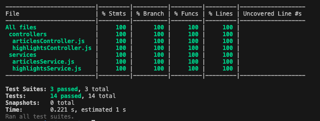

# articles-dashboard
 Mini full-stack dashboard app that provides quick insights on a list of articles for users. The front-end should present the data in a clean, user-friendly interface. The back-end should expose an API to serve article data and support filtering and sorting.

 ##Server
Node.js with Express, Prisma as ORM and SQLite as database.

//TODO: Create install.sh
Instructions
```
npm install
npx prisma generate
```
*Not sure if 'npm run prisma:seed' too, I will see when I try to install this repository from scratch.*
*Whether I have to, makes not sense to have dev.db filled in the repository, in theory this instruction is not needed and my database is ready to use*

To run API:
```
cd server
npm start
```

To test:
```
npm test
```



